# dysync.net - 抖音同步工具（抖小云）

`dysync.net` 是一款基于 **.NET Core ** 和 **Vue** 开发的工具，用于同步抖音收藏夹、「我喜欢」的视频及指定博主作品，支持多账号同步，内置视频信息刮削功能，同步后的视频可直接在 Emby 或 Jellyfin 中播放。

> 🔧 **问题反馈**：如使用中遇到任何问题，欢迎进Q群反馈：759876963，不一定及时回复，见谅。

---

## 📺 Emby 效果预览
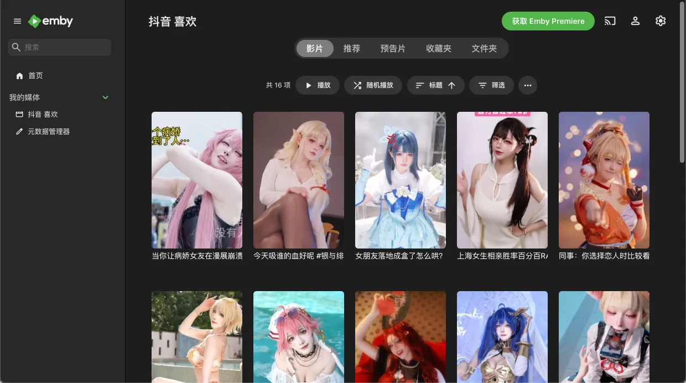

---

## 📋 目录
- [dysync.net - 抖音同步工具（抖小云）](#dysyncnet---抖音同步工具抖小云)
  - [📺 Emby 播放效果预览](#-emby-播放效果预览)
  - [📋 目录](#-目录)
  - [1. 获取抖音关键信息（必做！同步核心凭证）](#1-获取抖音关键信息必做同步核心凭证)
    - [1.1 提取抖音 Cookie](#11-提取抖音-cookie)
    - [1.2 提取 `sec_user_id`（个人/指定博主）](#12-提取-sec_user_id个人指定博主)
  - [2. 路径映射规则（核心！错配会导致无法访问/数据丢失）](#2-路径映射规则核心错配会导致无法访问数据丢失)
  - [3. 默认账号密码（首次登录用）](#3-默认账号密码首次登录用)
  - [4. 运行方式（推荐 Docker Compose）](#4-运行方式推荐-docker-compose)
    - [镜像版本](#镜像版本)
    - [构建命令示例](#构建命令示例)
      - [方式一：Docker 命令行](#方式一docker-命令行)
    - [方式二：Docker Compose 运行（推荐）](#方式二docker-compose-运行推荐)
  - [🚀 5. 软件截图](#-5-软件截图)
  - [🚀 5. 已有功能与计划](#-5-已有功能与计划)

---

## 1. 获取抖音关键信息（必做！同步核心凭证）

Cookie 及 `sec_user_id` 是同步功能的核心，需严格按步骤获取，避免遗漏或错误。


### 1.1 提取`Cookie`以及 `sec_uer_id` 
1. 打开 **抖音网页版** (https://www.douyin.com/) 并登录目标账号；
2. 进入个人主页，按下F12进入开发者模式、并切换到 `网络`(也可能叫`network`).
3. 在筛选框中输入`/follow`.
4. 点击自己头像边上的 `关注` 按钮、会弹出你的关注列表,然后在右侧网络请求里面会出现多个请求,随便选一个.
4. 在请求的标签里面切换到`负载`(也可能叫`payload`)
5. 找到sec_user_id，复制值即可
6. 在请求的标签里面切换到`标头`(也可能叫`Headers`)
7. 往下拉，直到出现`Cookie` ，复制完整的值,注意前后不要带换行符，很多人会多复制个换行符出来.

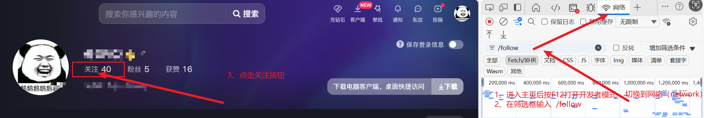
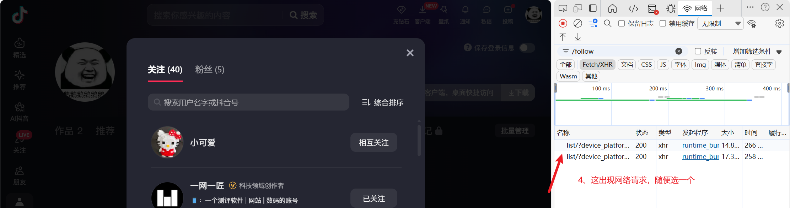

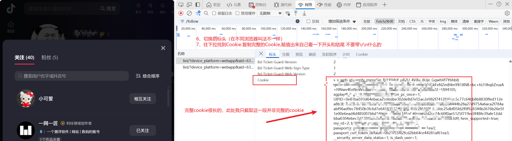

### 1.2 提取 博主的`sec_user_id`以及博主的uid
- **对于想下载博主视频，但是又不想关注博主，需要用到**
- 1.进入博主主页，按`F12` 点击`Network` 或`网络` 筛选器里面填`/web/aweme/post` 然后切到`预览`或`preview` 展开 json数据结果 找到`aweme_list` 然后随便点开其中一个子项 即可找到`aweme_list[0].author.sec_uid` 这便是博主的uid 。后续在关注列表中，需要手动添加非关注博主同步视频时将会要用到。
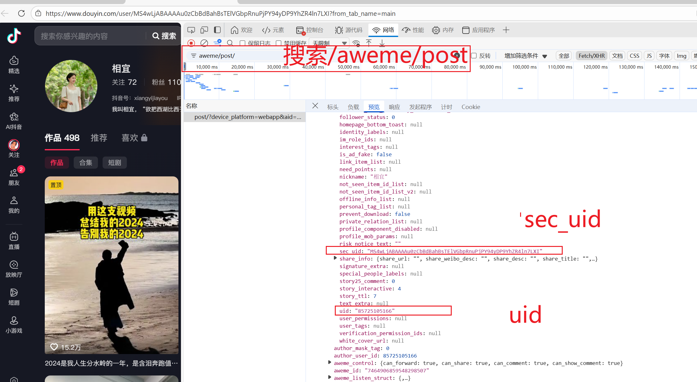
---

## 2. 路径映射规则（核心！错配会导致无法访问/数据丢失）
为实现视频在 Emby/Jellyfin 中正常播放及数据持久化，需正确配置本地路径与容器路径的映射：

| 存储类型     | 容器内路径      | 本地路径配置要求                                                      | 用途说明                   |
| ------------ | --------------- | --------------------------------------------------------------------- | -------------------------- |
| 个人收藏视频 | `/app/collect`  | 映射到本地目录（如 NAS：`/volume1/抖音/收藏`、电脑：`D:/抖音/收藏`）  | 存储同步后的收藏视频       |
| 个人喜欢视频 | `/app/favorite` | 映射到本地目录（建议与收藏视频路径区分，如 `/volume1/抖音/喜欢`）     | 存储同步后的「我喜欢」视频 |
| 图文视频     | `/app/images`   | 映射到本地目录（建议与收藏视频路径区分，如 `/volume1/抖音/图文视频`） | 存储同步后的「图文视频」   |
| 指定博主视频 | `/app/uper`     | 映射到本地目录（如 `/volume1/抖音/博主作品`）                         | 存储同步后的博主视频       |
| 指定博主视频 | `/app/mix`     | 映射到本地目录（如 `/volume1/抖音/合集`）                         | 存储同步后的合集视频       |
| 指定博主视频 | `/app/series`     | 映射到本地目录（如 `/volume1/抖音/短剧`）                         | 存储同步后的短剧视频       |
| 数据库文件   | `/app/db`       | 映射到本地稳定目录（如 `/volume1/抖音/db`）                   | 持久化配置、同步记录       |
| 数据库文件   | `/app/mp3`      | 映射到本地稳定目录（如 `/volume1/抖音/mp3`）                   | 图文视频自定义音频(用于原视频音频带版权的情况)       |

> ✅ **关键注意**：  
> 1. 抖音授权时配置的路径为上面 表格里面 容器内路径 如   `/app/collect` 且注意 必须是`/`开头，路径可以自己随便命名，只要保证 授权里面配的路径有在docker-compose里面添加映射即可
> 2. 未配置路径映射时，文件仅存于容器内部，且容器删除后数据丢失。


---

## 3. 默认账号密码（首次登录用）
首次访问后台管理页面时，使用以下默认账号密码：
- **用户名**：`douyin`
- **密码**：`douyin2026`

> ⚠️ **安全建议**：登录后修改密码。

---

## 4. 运行方式（推荐 Docker Compose）

### 镜像版本

| 镜像标签          | 架构           |
| ----------------- | -------------- |
| `beta_2.1.1`      | x86_64 (amd64) |
| `arm_2.1.1`       | ARM64          |


### 构建命令示例

将下方命令中的「本地路径」替换为你的实际路径，终端执行即可：


### 方式一：Docker Compose 运行（推荐）
创建 docker-compose.yml 文件，复制以下内容，替换「本地路径」后执行 docker-compose up -d：

<span style="color: red; font-weight: bold;">需要注意：unraid玩家需要增加 user配置 --user 1000:100</span>

```bash

services:
  dysync:
    image: ccr.ccs.tencentyun.com/jianzhichu/dysync:beta_2.1.1
    container_name: dysync2026  # 容器名称
    restart: unless-stopped # 始终重启容器，除非容器被手动停止或Docker服务停止
    ports:
      - "10101:10101" 
    volumes:
      # 基础路径映射
      - /vol2/1000/media/dysync/db:/app/db          # 数据库目录（持久化配置和同步记录）
       # 默认音频目录（用于图文和动态视频合成时遇到因版权无法下载的音频时用作合成视频所需要的音频）
      - /vol2/1000/media/dysync/mp3:/app/mp3         
      - /vol2/1000/media/dysync/dy1/coll:/app/collect   # 个人收藏视频目录
      - /vol2/1000/media/dysync/dy1/fav:/app/favorite  # 个人喜欢视频目录
      - /vol2/1000/media/dysync/dy1/up:/app/uper      # 指定博主视频目录 
      - /vol2/1000/media/dysync/dy1/mix:/app/mix      # 合集 不需要可以删除
      - /vol2/1000/media/dysync/dy1/series:/app/series      # 短剧 不需要可以删除
      
      # 多账号时路径映射示例（可选，也可以再授权时设置路径与第一个账号的路径一致）
      - /vol2/1000/media/dysync/dy2/collect:/app/collect2 
      - /vol2/1000/media/dysync/dy2/fav:/app/favorite2  
	  - /vol2/1000/media/dysync/dy2/up:/app/uper2

    network_mode: bridge
    dns:
      - 8.8.8.8  # Google DNS（提升海外访问稳定性）
      - 114.114.114.114  # 国内DNS（提升国内访问稳定性）
      - 223.5.5.5  # 阿里云DNS（备用）
    deploy:
      resources: 
          limits:  
           memory: 250m #限制内存占用不超过250mb，如果有图文视频下载需求，不建议设置

```

## 🚀 5. 软件截图

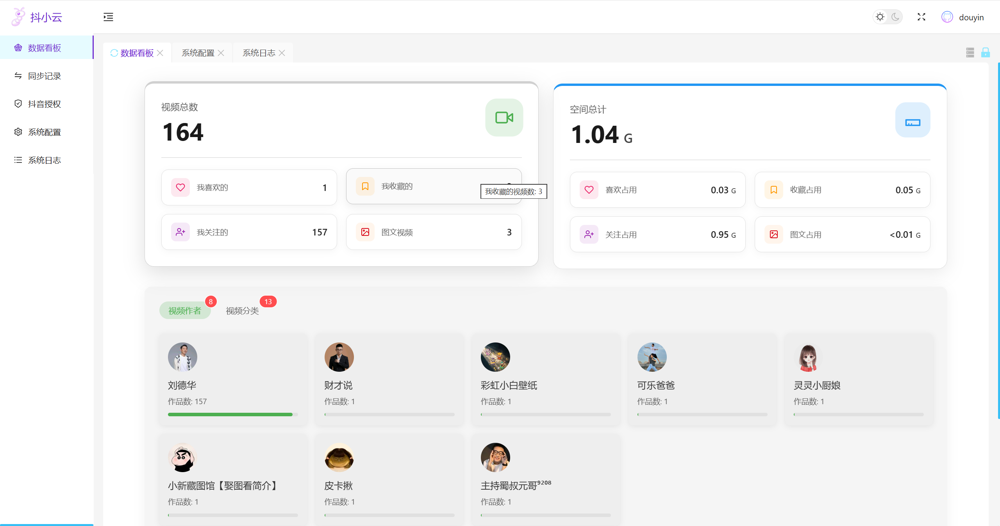


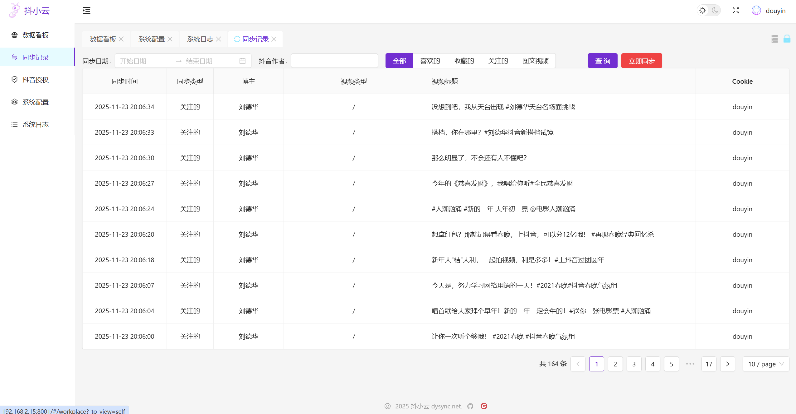

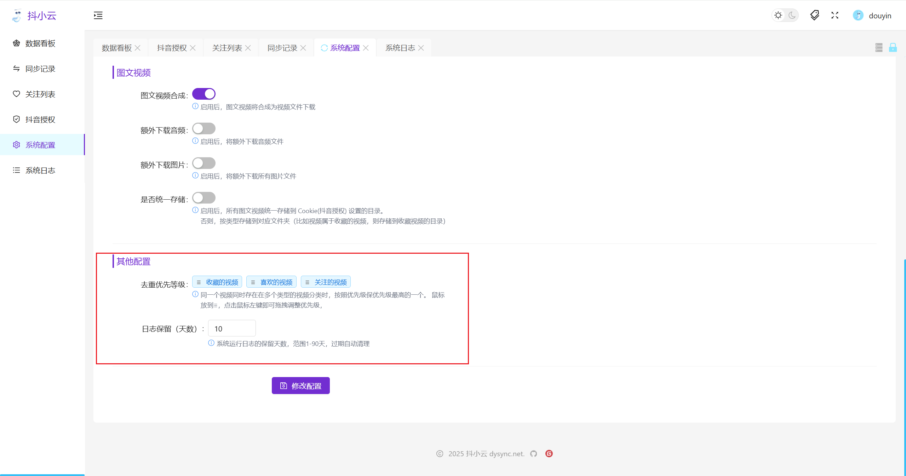

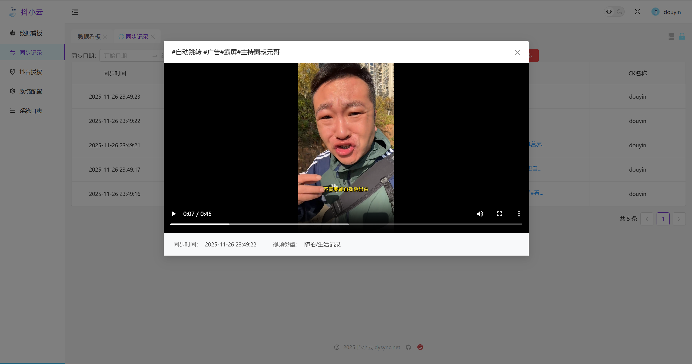

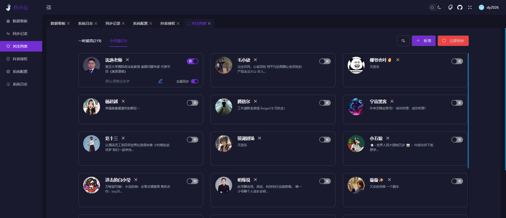

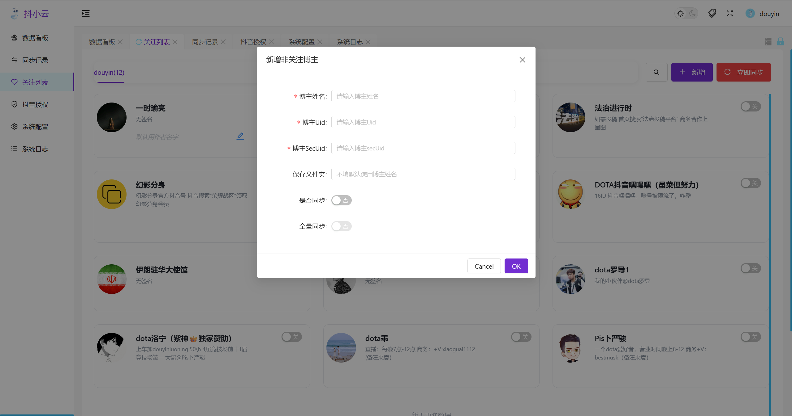

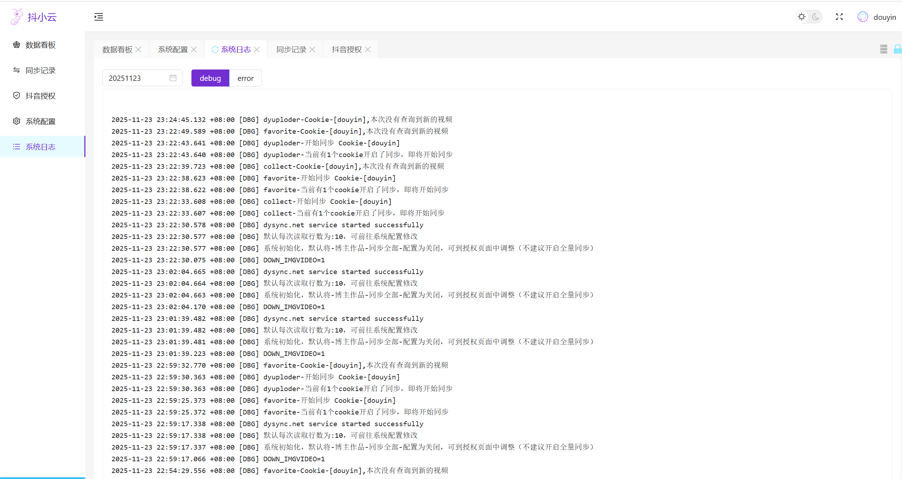


<div align="center">
  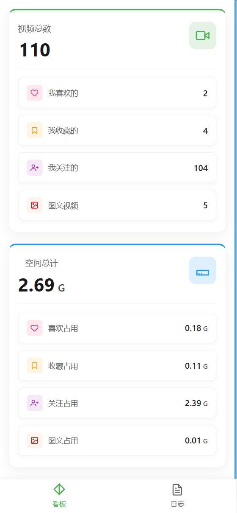
  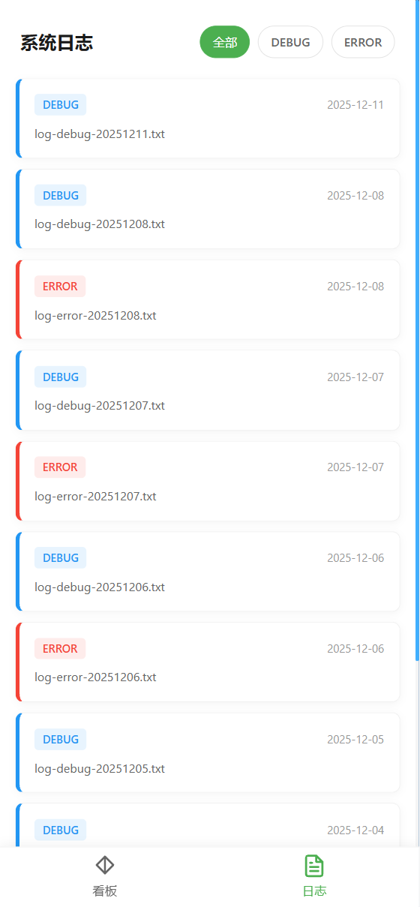
  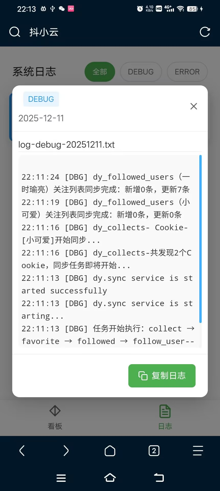
</div>

## 🚀 5. 已有功能与计划


1. ✅ 支持多账号同步（每个账号可单独配置存储路径）

2. ✅ 收藏的视频

3. ✅ 喜欢的视频（点赞的视频）

4. ✅ 图文视频（需要将图片 + mp3 合成视频）

5. ✅ 指定博主的视频,可配置是否单独存放一个总文件夹，是否直接用视频标题做文件名

6. ✅ 增加清除日志（防止容器被日志占用太多空间，可配置保留天数）

7. ✅ 将网站名称改成 "抖小云" 灵感来源于哪吒电影 驮门的那个小云云

8. ✅ Cookie 过期提醒，在D音授权页可查看

9. ✅ 自动根据去重规则进行去重（可设置去重优先级，同一个视频出现再多个分类时适用）

10. ✅ 在同步记录页面中直接播放视频

11. ✅ 关注列表同步。

11. ✅ 选中记录，批量重新同步。以及分享（比较简陋）

12. ✅ 关注列表支持新增，非关注的博主

13. ✅ 增加永久删除功能，删除后，以后不会再同步该视频

14. ✅ 增加配置项及关注列表（手动添加部分）导出导入功能

15. ✅ 增加移动端（主要统计数据和日志以及最近十条同步记录-可手机端播放）

16. ✅ 增加开关配置是否仅同步最近视频，默认开启（针对之前收藏或者点赞了很多乱七八糟的视频，太多，又不想一个个去抖音取消的情况）
 
17. ✅ 完成飞牛fpk打包:https://github.com/jianzhichu/FnDepot

18. ✅ 合集、短剧、自定义收藏夹下载。


# 免责声明

本项目（dysync.net）仅作为技术研究与学习交流的开源项目，其所有代码、功能及相关内容均不代表任何第三方平台的官方服务或立场。使用本项目前，请仔细阅读以下条款：

## 1. 授权与使用限制
- 本项目未获得抖音（Douyin）等任何第三方平台的官方授权、合作或认可，与该等平台无任何关联。
- 项目功能仅允许用于个人技术研究和学习目的，严禁用于商业用途、非法活动或违反任何第三方平台规则的行为。

## 2. 知识产权说明
- 项目中涉及的第三方平台（如抖音）的名称、商标、接口、内容等均为其各自所有者的知识产权。
- 本项目仅对技术实现方式进行研究，不涉及对第三方知识产权的侵占或滥用。如因使用本项目引发知识产权争议，相关责任由使用者自行承担。

## 3. 风险提示与责任豁免
- 使用本项目可能导致违反第三方平台的用户协议或相关规定，进而导致账号限制、功能封禁等风险，此类风险由使用者自行承担。
- 项目开发者不对使用本项目产生的任何直接或间接损失（包括但不限于数据丢失、设备损坏、账号问题等）承担责任。
- 使用者应确保自身行为符合《网络安全法》《著作权法》等相关法律法规，不得利用本项目从事侵权、违法或违背公序良俗的活动。

## 4. 声明的修改与生效
- 本免责声明的最终解释权归项目开发者所有，开发者保留随时修改本声明的权利。
- 修改后的声明将在项目仓库中更新，建议使用者定期查阅。
- 一旦使用本项目的代码、功能或相关资源，即视为您已充分理解并同意本免责声明的全部条款。如不同意，请立即停止使用。