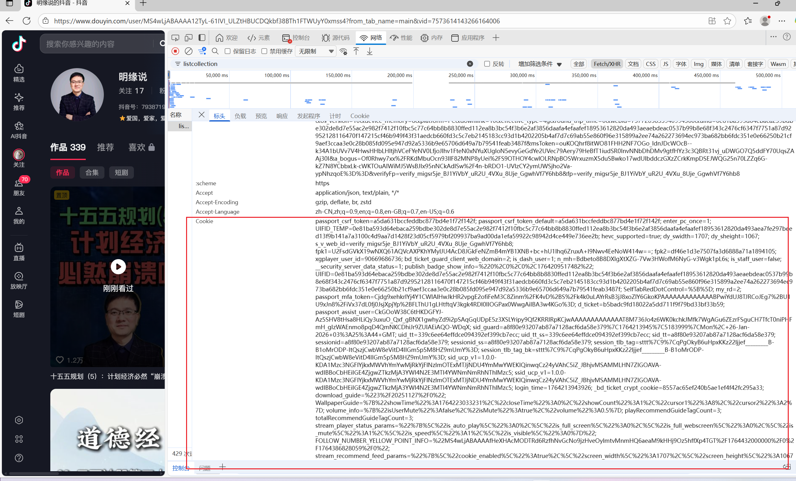
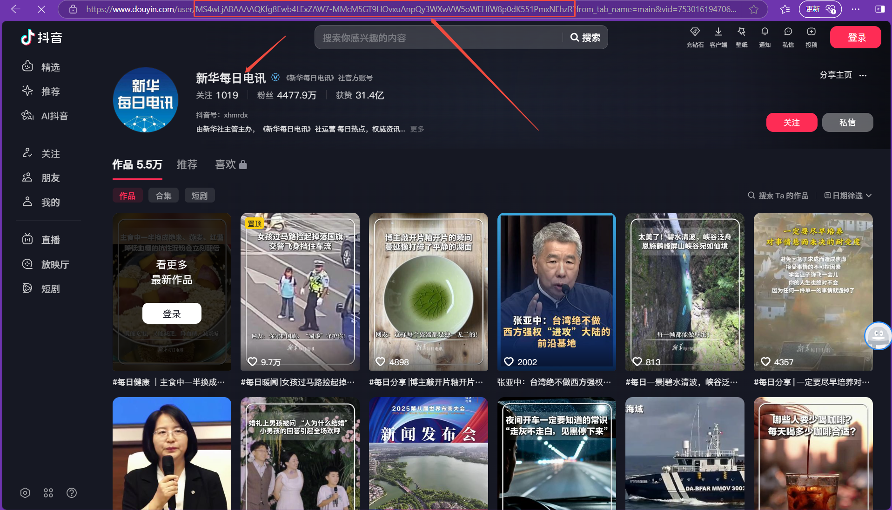
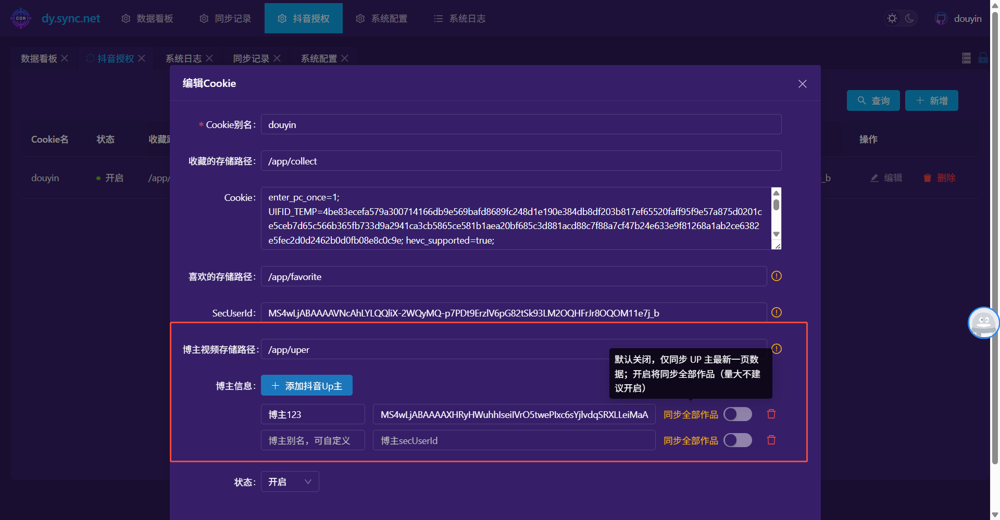
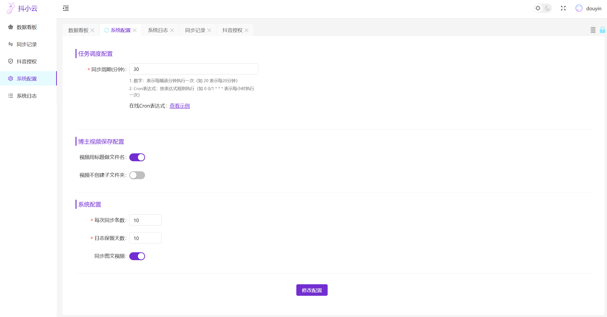

# dysync.net - 抖音同步工具（我收藏的、我喜欢的，指定博主）

`dysync.net` 是一款基于 **.NET Core 6.0** 和 **Vue** 开发的工具，用于同步抖音收藏夹以及我喜欢的视频，解决个人收藏和喜欢的视频容易失效的问题。支持多账号同步，并已预设刮削信息，同步后的视频可直接在 Emby 或 Jellyfin 中播放。

> 如在使用中有任何问题，欢迎添加 QQ：279225040 进行咨询。

---

#### 先放一张Emby的图


### 1. 获取抖音 Cookie 以及用户sec_user_d

Cookie 是同步功能的关键，请严格按照以下步骤获取：

1.  打开 **抖音网页版** (https://www.douyin.com/) 并登录。
2.  进入你的**收藏夹**页面。
3.  按 `F12` 打开浏览器「开发者工具」，切换到「Network (网络)」标签。
4.  在搜索框中输入 `v1/web/aweme/listcollection`。
5.  点击任意一条筛选出的请求，在右侧「Headers (标头)」中找到 `Cookie` 字段，**完整复制**其内容。




6.  进入博主主页浏览器地址栏中的便是博主的sec_user_id，复制其值。也可以在博主主页按 `F12` 打开「开发者工具」，切换到「Network (网络)」标签，点击任意一条请求，在右侧「Headers (标头)」中找到 `sec_user_id` 字段，复制其值。

### 2. 路径映射规则

为了方便管理和播放，请理解并正确配置路径映射：


*   **视频存储路径**：容器内路径为 `/app/collect`。你需要将此路径映射到你本地的一个目录（如 NAS 或电脑硬盘）。**这个本地路径必须与后续在「抖音授权」页面配置的「文件存储路径」完全一致**。
*   **数据库存储路径**：容器内路径为 `/app/db`。映射此路径用于持久化工具的配置和同步记录，防止容器删除后数据丢失。
*   **多账号配置**：如需同步多个账号，需为每个账号指定一个独立的容器内路径（如 `/app/user1`, `/app/user2`），并分别进行映射。

> **重要**：如果不进行路径映射，所有文件将保存在容器内部，无法直接在 EMBY/JF 中访问。

---

## 🔑 默认账号密码

首次登录后台管理页面时使用：

*   **用户名**：`douyin`
*   **密码**：`douyin2025`

> **建议**：登录后请修改密码，保障账号安全。

---

## 🚀 运行方式

你可以选择以下任一方式启动服务。**推荐使用 Docker Compose**，因为它更易于管理和维护。

### 方式一：Docker 命令行

将下方命令中的本地路径替换为你的实际路径，然后在终端中执行。

```bash
docker run -d --restart=always \
  -v /你的/本地/视频1/路径:/app/collect \
  -v /你的/本地/视频2/路径:/app/favorite \
  -v /你的/本地/数据库/路径:/app/db \
  -v /你的/本地/数据库/路径:/app/uper \
  -p 10101:10101 \
  --name dysync2025 \
  registry.cn-hangzhou.aliyuncs.com/jianzhichu/dysync.net

###-p 后面的第二个端口 必须10101（源码里面写死了）
```

### 方式 2：Docker-Compose 运行（推荐）

```yml
version: '3.8'

services:
  dysync:
    image: registry.cn-hangzhou.aliyuncs.com/jianzhichu/dysync.net
    container_name: dysync2025  # 容器名称，可自定义
    restart: always  # 容器异常退出时自动重启
    ports:
      - "10101:10101"  # 端口映射：本地端口:容器端口（容器端口10101不可修改）
    volumes:
      # 第一个账号的收藏的视频存储路径（本地路径:容器路径）
      - /本地视频路径1:/app/collect
      # 第一个账号的喜欢的视频存储路径（本地路径:容器路径）
      - /本地视频路径1:/app/favorite
      # 数据库存储路径
      - /本地数据库路径:/app/db
      - /指定博主视频路径:/app/uper
      # 第二个账号的视频存储路径（多账号示例，需在后台对应配置）
      - /本地视频路径2:/app/yeyeye
    # （可选）如需添加环境变量，取消下方注释并配置
    # environment:
    #   - ENV_VAR_NAME=value
    # （可选）如需自定义网络，取消下方注释并配置
    # networks:
    #   - custom_network

# （可选）自定义网络配置
# networks:
#   custom_network:
#     driver: bridge

```
### 方式 3：自己编译运行
   ##### 前端源码在/app里面
```
yarn install
yarn dev
yarn run build

### 运行可能报错，less包如果报错，运行下面的命令即可
 yarn remove less && yarn add less@4.1.3 -D

```
 ##### 后台编译要先安装.netcore环境 netcore sdk
 ```bash
 dotnet --version  # 输出安装的 .NET Core 版本，说明安装成功
 dotnet build
 dotnet build -c Release  # 生成文件在 bin/Release/netX.X/ 目录

### 调试模式运行
dotnet run
 ```
 
## 软件截图


