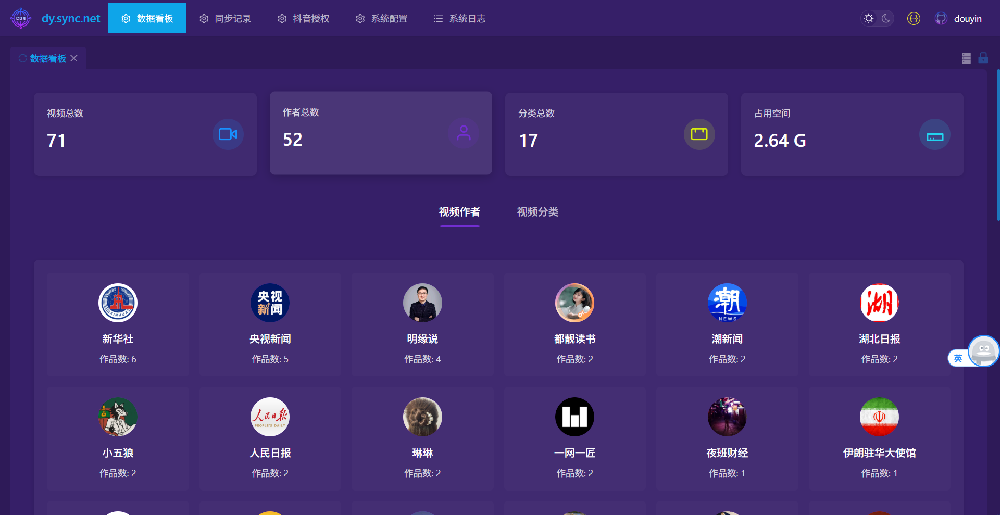
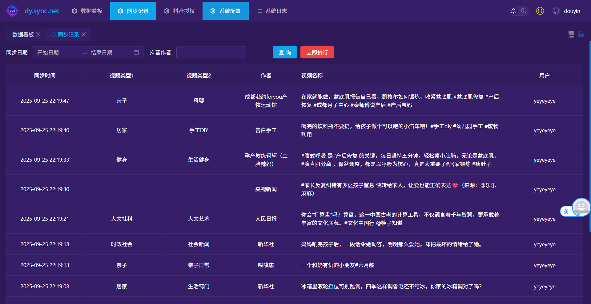
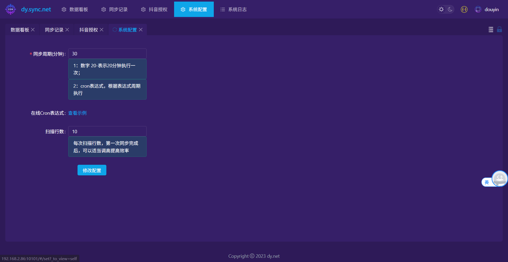
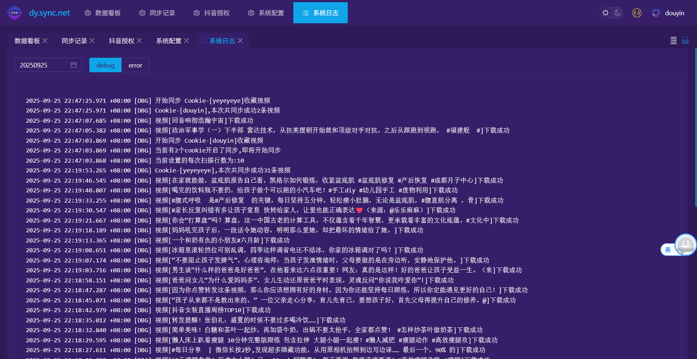

# dysync.net

## 项目介绍
`dysync.net` 是一款基于 **.NET Core 6.0** 和 **Vue** 开发的工具，用于功能是同步抖音收藏夹的视频，解决收藏视频容易失效的问题，让你喜爱的视频能够永久存储在自己的硬盘中。而且支持多个抖音账户同时同步，并且已经简单做了刮削配置，放到EMBY或者jf可以直接播放。
## 代码暂不开源--写的比较乱，不好意思放出来。

## 软件截图






## 运行方式

### 使用Docker运行
```bash
docker run -d --restart=always \
  -v /volume2/mediay/dysync:/app/downloads \
  -v /volume1/docker/dysync/db:/app/db \
  -p 18101:3002 \
  --name dysync2025 \
  registry.cn-hangzhou.aliyuncs.com/jianzhichu/dysync.net:v1.0.0
```

### 使用Docker-Compose运行

```
version: '3.8'

services:
  dysync:
    image: registry.cn-hangzhou.aliyuncs.com/jianzhichu/dysync.net:v1.0.0
    container_name: dysync2025
    restart: always
    ports:
      - "18101:10101"
    volumes:
      - /volume2/mediay/dysync:/app/downloads
      - /volume1/docker/dysync/db:/app/db
      - /volume2/mediay/dysync2:/app/yeyeye
    # 可以根据需要添加其他配置，如环境变量、网络等
    # environment:
    #   - ENV_VAR_NAME=value
    # networks:
    #   - custom_network

# 如果需要自定义网络，可以取消下面的注释
# networks:
#   custom_network:
#     driver: bridge
    
```

##注意：图中映射路径 /app/downloads 要与菜单"抖音授权"中文件存储路径一致。如果有多个抖音用户同步，需要指定多个路径。如果不映射出来，文件会存在容器中，不方便放到NAS 影视播放器播放。

最后放一张EMBY的图

